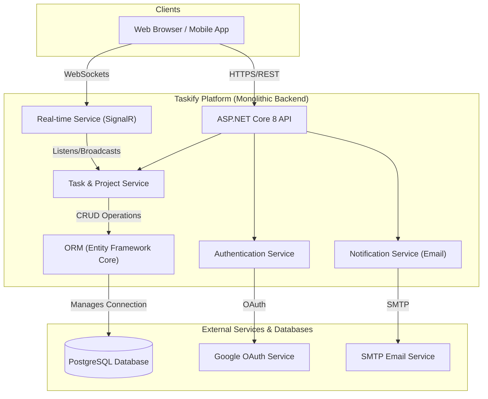

# Taskify - Task and Project Management Platform

Welcome to Taskify, a powerful and feature-rich platform for task and project management. This project provides a robust, monolithic back-end service designed to support modern, collaborative work environments with real-time features.

## 🏗️ System Architecture

The platform is built using a monolithic architecture, where all core functionality is managed within a single, cohesive ASP.NET Core 8 application. This design simplifies development and deployment while providing a powerful foundation for the platform's features.



---

## ✨ Key Features

Taskify offers a comprehensive suite of features for effective project management and team collaboration.

### Core Project Management
- **User Authentication**: Secure user registration and login with email/password (using BCrypt hashing), plus social sign-on via Google OAuth 2.0.
- **Project & Task Management**: Create projects, and within them, create, assign, and track tasks with detailed attributes like status, priority, and due dates.
- **Content Engagement**: Interact with tasks through a commenting system and attach relevant files to keep all information centralized.
- **Organization**: Use tags to categorize and filter tasks, making it easy to find what you're looking for.
- **Event Tracking**: Manage and monitor important project milestones and events.

### Real-time Collaboration
- **Instant Messaging**: A high-performance, real-time one-on-one and group chat is powered by ASP.NET Core SignalR.
- **Live Notifications**: Receive real-time updates within the application for important events like task assignments and new comments.

### System Notifications
- **Email Alerts**: The system leverages MailKit to send email notifications for critical updates, ensuring users stay informed even when not actively using the application.

---

## 🛠️ Technology Stack

The platform is built on a foundation of powerful and scalable technologies from the .NET ecosystem.

| Category                  | Technology / Service                                       |
| ------------------------- | ---------------------------------------------------------- |
| **Backend Framework**     | ASP.NET Core 8                                             |
| **Language**              | C#                                                         |
| **Data Persistence**      | PostgreSQL with Entity Framework Core 8 (ORM)              |
| **Real-time Communication**| ASP.NET Core SignalR                                       |
| **Authentication**        | JWT, Google OAuth 2.0, BCrypt.Net-Next (for password hashing) |
| **API Documentation**     | Swashbuckle (Swagger)                                      |
| **Emailing**              | MailKit                                                    |

---

<details>
<summary>🚀 Getting Started (For Developers)</summary>

### Prerequisites

- .NET 8 SDK
- PostgreSQL Server
- Git

### Environment Setup

1.  Clone the repository:
    ```bash
    git clone https://github.com/your-username/taskify-backend.git
    cd taskify-backend
    ```

2.  Configure your settings in `appsettings.Development.json`:
    - Update the `DefaultConnection` string to point to your PostgreSQL database.
    - Configure your `SmtpSettings` with the credentials for your email sending service.
    
    ```json
    {
      "ConnectionStrings": {
        "DefaultConnection": "Host=localhost;Port=5432;Database=taskify_db;Username=postgres;Password=your_password"
      },
      "SmtpSettings": {
        "Server": "smtp.example.com",
        "Port": 587,
        "SenderName": "Taskify Notifications",
        "SenderEmail": "noreply@taskify.com",
        "Username": "your-smtp-username",
        "Password": "your-smtp-password"
      }
    }
    ```

### Running the Application

1.  Install dependencies (restores NuGet packages):
    ```bash
    dotnet restore
    ```

2.  Apply Entity Framework migrations to set up the database schema:
    ```bash
    dotnet ef database update
    ```

3.  Run the application:
    ```bash
    dotnet run
    ```

4.  Access the services:
    - The API will be running on the configured launch URL (e.g., `http://localhost:5000` or `https://localhost:5001`).
    - The interactive Swagger UI for API documentation will be available at `/swagger`.

</details>

## 🤝 Contributing

Contributions are welcome! Please feel free to fork the repository, create a feature branch, and submit a pull request.

## 📄 License

This project is licensed under the MIT License.
